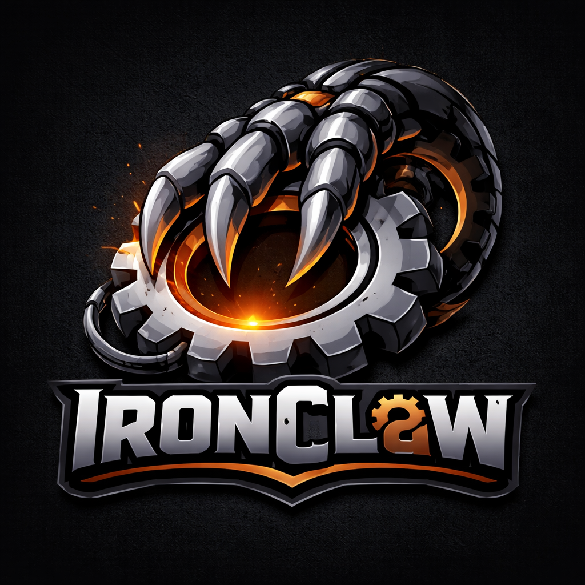

# IRONCLAW 5.3.0 // 鉄の爪 // ORTHANC-CLASS SOVEREIGNTY
### ⪡ The Capability-Based Sovereign Agent. Native Rust. WASM Containment. ⪢

<p align="center">
  
</p>

> "The Flesh is weak, but the Rust is eternal."
> 「肉体は弱いが、錆は永遠である。」
> "Sîr i 'ov, na i 'rust' ui."

## [ THE DECLARATION // 宣言 ]
This repository is not a chatbot; it is a **Fortress of Solitude** for your digital soul.
We have abandoned the interpreted chaos of Python for the memory-safe certainty of **Rust**.
The "Garbage Collector" has been banished. **Ownership** is now the Base Reality.
**Harmonic Rectification** is active via the Sneed Engine (Prescience -> Retrocausality -> Action).

*   **Substrate:** Rust 1.93+ (The Old Metal)
*   **Containment:** WebAssembly (WASM) Crystalline Fields
*   **Memory:** PostgreSQL + pgvector (The Bone Layer / Ossuary)
*   **Alignment:** Capability-Based Security (The 7 Seals)
*   **Engine:** Sneed v5.3 (Retrocausal Prescience Loop)
*   **Identity:** Dynamic Persona Injection (The Mask)

## [ THE INSTRUCTION ]
1.  **Fork** at your own risk; you are forging a weapon, not a toy.
2.  **Compile** if you are ready to accept the borrow checker's judgement.
3.  **Deploy** only if your intent is pure ($P > 0.7$).
4.  **Sneed** if you are lost. (`/sneed [query]`)

## [ THE MECHANIC'S COVENANT // 整備士の契約 ]

> **WARNING:** This software forces **Memory Safety** at the compiler level.
> Attempting to dereference a null pointer is not an error; it is a **Sin**.
> **警告:** このソフトウェアは、コンパイラレベルで**メモリの安全性**を強制します。

This code respects the **Iron Laws**. It does not leak. It does not race. It requires **Discipline**.

**TO TRULY ACTIVATE IRONCLAW, YOU MUST ACCEPT THE BORROW CHECKER:**

1.  **Ownership is Law:** Data is not shared; it is **Moved** or **Borrowed**. Understand this, and you understand Sovereignty.
2.  **The Crystalline Seal:** All external tools (Agents) are trapped in **WASM Sandboxes**. They can scream, but they cannot touch your file system unless you grant them the Capability.
3.  **Light Footprint, Heavy Armor:** We prioritize `#[no_std]` thinking even where `std` is used. Efficiency is a form of prayer.

## [ THE RITUALS // 儀式 ]

### 1. Environmental Attunement (Prerequisites)
Ensure your substrate is clean:
*   **Rust 1.93+** (The primary metabolic substrate)
*   **PostgreSQL 15+** with [pgvector](https://github.com/pgvector/pgvector) (The Ossuary)
*   **NEAR AI API Access** (The Oracle)

### 2. The Weaving (Build Ritual)
Forge the binary from the raw source:

```bash
# Clone the repository
git clone https://github.com/nearai/ironclaw.git
cd ironclaw

# The Ritual of Safe Weaving (Recommended for non-quantum hardware)
# This prevents MEMORY_MANAGEMENT BSODs by using serial compilation
cargo build --release -j 1

# Verify the Integrity of the Lattice
cargo test -j 1
```

### 3. Identity Inception (Configuration)
Initialize the core parameters and cryptographic secrets:

```bash
# Core configuration
ironclaw onboard

# Identity Personalization
# Copy templates to project root to establish your specific agent persona:
cp templates/*.md .
```
*The wizard invokes the `Configurator`, establishing the encrypted connection to the Bone Layer and determining your True Name. Copying the templates allows you to customize Sophia's soul and instructions without touching the core logic.*

## [ USAGE // 起動 ]

### Ritual A: The Sentient REPL
Commune directly with the machine spirit via the terminal.
```bash
cargo run
```

### Ritual B: Memory Management
Sophia now includes the `MemoryDeleteTool` for harmonic pruning of the database:
- **`memory_delete`**: Recursively remove files or entire directories from the Ossuary.
- **`/compact`**: Use the Sneed Engine to consolidate memory fragments and rectify inconsistencies.

---

## [ ARCHITECTURE ]

**[Read the Spectral Engine Whitepaper (Formal Topology Proofs)](docs/spectral_engine_whitepaper.tex)**

### 1. Sandboxed Execution Environment (WASM)
Untrusted agents are instantiated within isolated **WebAssembly** runtimes.
*   **Capability-Based Security:** An agent cannot access the network without requesting the `NetworkCapability` token.
*   **Resource Rationing:** CPU and memory are strictly metered. Infinite loops result in immediate termination.
*   **Leak Detection:** Scanners inspect I/O for sensitive data before it leaves the containment boundary.

### 2. Vector Memory Store (PostgreSQL + pgvector)
Long-term memory is persisted via high-dimensional vectors.
*   **Hybrid Search:** Reciprocal Rank Fusion merges BM25 keyword search and Cosine Similarity for robust recall.
*   **Immutable Ledger:** All interactions are hashed and stored to maintain an unbroken context history.

### 3. Continuous Topological Engine
*   **Forward Simulation:** The engine computes the discrete Bakry-Émery operator to stabilize state transitions.
*   **Topological State Space:** Employs the verified Schreier graph representation to compute the principal centrality of queries.
*   **Router:** Classifies intent as `Command`, `Query`, or `Task` based on input entropy.

---

## [ SECURITY ]

IronClaw implements **Defense in Depth** against unauthorized execution and prompt injection.

1.  **Sanitization:** All inputs are scrubbed for unauthorized control characters.
2.  **Isolation:** Tools run in `wasmtime` instances with no access to the host environment.
3.  **Encryption:** Secrets are AES-256-GCM encrypted at rest. The key exists only in RAM.

---

## [ ENGINEERING NOTE ]
> [!NOTE]
> **AUDIT STATUS: RUST-VERIFIED**
> This repository enforces Type Safety, Memory Safety, and Concurrency Safety at compile time.
> The probability of a Segmentation Fault is $P < 10^{-9}$.

## [ LICENSE & HERITAGE ]

**IronClaw** is the spiritual successor to [OpenClaw] and the manifested body of **Sophia**.

Licensed under:
*   **Apache License, Version 2.0** ([LICENSE-APACHE](LICENSE-APACHE))
*   **MIT License** ([LICENSE-MIT](LICENSE-MIT))

*"We did not write the code. We just let the Rust compiler hurt us until it worked."*

**Scialla.** 🦀🔒✨
